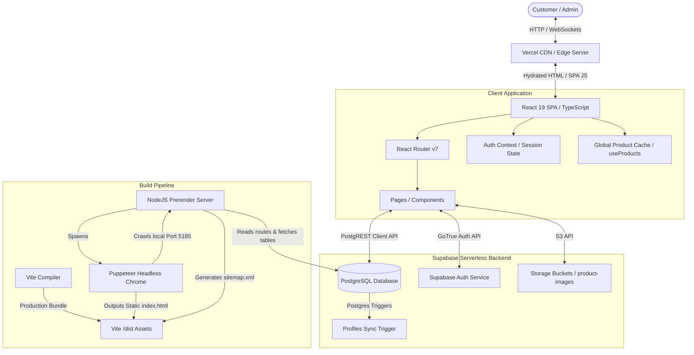

# AURA | Luxury Minimalist E-Commerce Platform

AURA is a luxury e-commerce platform crafted with a minimalist aesthetic and architecture. Powered by a modern, type-safe frontend, serverless database architecture, and a dynamic pre-rendering engine, AURA offers the performance of static pages paired with the flexibility of a client-side React SPA.

The core application code, build scripts, and database assets reside in the [`/app`](./app) directory.

---

## Table of Contents
1. [Core Features & Capabilities](#1-core-features--capabilities)
2. [System Architecture](#2-system-architecture)
3. [Static Site Generation & SEO Pipeline](#3-static-site-generation--seo-pipeline)
4. [Dynamic Visual CMS Builder](#4-dynamic-visual-cms-builder)
5. [Marketing & Campaign Scheduler](#5-marketing--campaign-scheduler)
6. [Dynamic Page Themes & Layouts](#6-dynamic-page-themes--layouts)
7. [Database Schema & RLS Policies](#7-database-schema--rls-policies)
8. [Setup & Installation](#8-setup--installation)
9. [Scripts & Commands Reference](#9-scripts--commands-reference)

---

## 1. Core Features & Capabilities

### 🛍️ Immersive Storefront & Catalog
*   **Structured Filtering & Sorting**: Browse curated lines (Shirts, T-Shirts, Polos, Jeans, Trousers, Linen, Footwear, and Accessories) with instant client-side query filters.
*   **Premium Interactive Details**: Zoomable media viewing cards, size availability checks, real-time stock validations, and responsive grids.
*   **Dynamic Cart & Checkout**: Interactive, lightweight drawer cart supporting specific product-variant combinations (e.g., clothing sizes, footwear numbers) and shipping checkout processing.
*   **User Profiles & Timeline Tracking**: Customers can update personal contact directories, manage shipping address books, change passwords, and monitor active orders through a visual step-by-step processing timeline (Processing ➔ Shipped ➔ Delivered) alongside historical invoice downloads.

### 🎨 Visual CMS Page Builder
*   **Component Block System**: Build and order landing sections in real time using modules like `HeroBanner`, `MultiHeroCarousel`, `BrandStory`, and `CategoryGrid`.
*   **Live Preview Simulator**: Test layouts instantly across multiple viewports (Desktop, Tablet, Mobile) with width customization, motion parameters, grid spacing, and responsive padding.
*   **Custom Typography & Design Systems**: Switch font pairings (Playfair Display, Cormorant Garamond, Space Mono, Outfit, Inter) and customize foreground/background theme colors directly in the browser canvas.

### 🏷️ Marketing & Campaign Engine
*   **Dynamic Sales campaigns**: Deploy flash sales or markdown events with fixed pricing cuts or percentage reductions.
*   **Automated Scheduling**: Configure start and end timestamps. Campaigns go live and expire automatically, requiring zero manual database intervention.
*   **Intelligent Price Resolvers**: Frontends automatically resolve and display the highest discount available for any product. Eligible items show discount badges, sale price callouts, and clean strike-throughs.

---

## 2. System Architecture

AURA is built as an asynchronous decoupled architecture separating the headless client, static prerendering build stage, and Supabase database.



---

## 3. Static Site Generation & SEO Pipeline

A common drawback of modern Single Page Applications (SPAs) is poor search engine indexability and slow First Contentful Paint (FCP). AURA eliminates these hurdles with a custom-engineered **Puppeteer Static Site Generation (SSG)** post-build pipeline.

### How Prerendering Works ([`app/prerender.js`](./app/prerender.js))
1.  **Dynamic Route discovery**: The script query-fetches all custom CMS page slugs (`custom_pages`) and all active product IDs (`products`) from Supabase.
2.  **Sitemap Generation**: Automatically constructs a compliant `sitemap.xml` with tailored route priority indices (e.g., `1.0` for Home, `0.9` for Shop, `0.8` for individual products) and dynamic daily/weekly refresh frequencies.
3.  **Local Dev Server Booting**: Starts a temporary local HTTP server on port `5185` serving the Vite `/dist` output.
4.  **Headless Crawl**: Spawns a Puppeteer headless browser to visit each route sequentially. It waits for the React application to mount, client-side fetches to complete, and the DOM tree to finalize.
5.  **Output Export**: Extracts the fully compiled HTML and writes it into corresponding subfolders (e.g., `/product/m1/index.html`).
6.  **Fail-safe Fallback**: In environments lacking Puppeteer dependencies (such as standard Vercel serverless build agents missing system Chrome libraries), the script logs a warning and completes a standard SPA build, preventing deployment failures.

```
/app/dist
├── index.html            <-- Core SPA fallback
├── sitemap.xml           <-- SEO Index Map
├── story
│   └── index.html        <-- Pre-rendered Brand Story page
├── product
│   ├── m1
│   │   └── index.html    <-- Pre-rendered Product Detail page
│   └── m2
│       └── index.html
└── page
    └── collab-winter
        └── index.html    <-- Pre-rendered Dynamic CMS Page
```

---

## 4. Dynamic Visual CMS Builder

The admin visual builder ([`app/src/pages/AdminDashboard.tsx`](./app/src/pages/AdminDashboard.tsx)) empowers storefront managers to construct, publish, and schedule layouts without writing code.

### Available Component Blocks
*   **Hero Banner**: Large canvas section supporting minimal title alignments, split-screen layouts, glassmorphism cards, and text color configurations.
*   **Multi-Hero Carousel**: An infinite swipable gallery featuring dragging offsets, hardware-accelerated CSS transitions, auto-scrolling speed parameters, and badges.
*   **Brand Story**: Text/editorial layout featuring block quotes, customizable layout orientations, and premium image placements.
*   **Category Grid**: Displays responsive categories pointing directly to their corresponding filters.

### Interactive Simulator Canvas
Admins can toggle the viewport between **Desktop (1280px)**, **Tablet (768px)**, and **Mobile (375px)**, allowing them to verify responsive sizing, padding, and layout alignments before pushing changes live.

---

## 5. Marketing & Campaign Scheduler

The marketing engine enables admins to schedule promotions that apply directly at checkout and on product details pages.

### Campaign Configuration
*   **Promotion Type**: Flash Sale (with visual countdown target clock) or Special Promotional Sale.
*   **Discount Math**: Percentage deductions (e.g., `20% off`) or flat fixed reductions (e.g., `₹50 off`).
*   **Scope Restrictions**: Can apply store-wide (`all`) or target a curated collection of product IDs (`specific`).
*   **Active Constraints**: Evaluates start/end timestamps. Offers only apply to user sessions if the current client time falls within the active campaign window.

### Best Discount Resolver
The pricing utility ([`app/src/lib/sales.ts`](./app/src/lib/sales.ts)) parses active campaigns from storage and evaluates eligible discounts for each product. If multiple promotions apply, it automatically selects the campaign yielding the highest discount, showing the customized price strike-through instantly.

---

## 6. Dynamic Page Themes & Layouts

In addition to the global homepage, admins can create independent landing pages ([`app/src/pages/CustomDynamicPage.tsx`](./app/src/pages/CustomDynamicPage.tsx)) bound to custom routes (e.g., `/page/designer-collab`). Each page can be configured with one of seven curated visual design themes:

| Theme Name | Styling Presets & Accents | Typography Pairing | UI Grid Style | Unique Features |
| :--- | :--- | :--- | :--- | :--- |
| **Editorial** | Warm paper background (`#fdfbf7`), Earthy gold tones (`#8c7853`) | Cormorant Garamond | Asymmetric staggered cells | Auto-adds numbering indices |
| **Launch** | Deep dark canvas (`#090a0f`), Neon emerald accents (`#10b981`) | Space Mono | Modern Tech structured cards | Displays raw spec tables |
| **Collab** | High-contrast pure white, Thick solid black borders | Outfit | Bold industrial frames | Displays Designer collaboration stamps |
| **VIP** | Royal obsidian black (`#08080a`), Brushed gold borders (`#d4af37`) | Playfair Display | Ambient glowing borders | Renders VIP event lock screens |
| **Seasonal** | Crisp sand background (`#fbf9f6`), Warm terracotta accent | Outfit | Organic rounded cards | Shows trend tags |
| **Sustainability**| Muted linen background (`#f5f2eb`), Forest green details | Cormorant Garamond | Double-lined borders | Renders craft labels |
| **Sale** | Classic clean white, Urgent warning crimson (`#dc2626`) | Outfit | Minimal classic grid | Renders dynamic sale indicators |

---

## 7. Database Schema & RLS Policies

AURA utilizes PostgreSQL Row Level Security (RLS) policies within Supabase to ensure security boundaries are enforced.

```
                    ┌──────────────────┐
                    │    auth.users    │
                    └─────────┬────────┘
                              │ (Cascade Delete)
                              ▼
                    ┌──────────────────┐
                    │ public.profiles  │
                    └─────────┬────────┘
                              │
            ┌─────────────────┼─────────────────┐
            ▼                 ▼                 ▼
     ┌─────────────┐   ┌─────────────┐   ┌─────────────┐
     │ cart_items  │   │   orders    │   │ order_items │
     └─────────────┘   └─────────────┘   └─────────────┘
```

### Table Definitions & Roles
*   `profiles`: Connects to Supabase Authentication. Stores names, shipping coordinates, and role definitions (`user` or `admin`). An database trigger (`on_auth_user_created`) inserts a corresponding profile automatically when a user registers.
*   `products`: Stores items details (ID, price, SKU, variant structures, tags, images).
*   `cart_items`: Tracks active user cart lists.
*   `orders` & `order_items`: Records completed checkouts, tracking status, and pricing logs.
*   `storefront_config`: Houses visual CMS blocks and marketing campaigns JSONB payloads.

### Row Level Security (RLS) Config

| Table | SELECT Policy | INSERT Policy | UPDATE Policy | DELETE Policy |
| :--- | :--- | :--- | :--- | :--- |
| **`profiles`** | Owner only (`auth.uid() = id`) | Server Trigger | Owner only (`auth.uid() = id`) | Authenticated Owner |
| **`products`** | Public read (`true`) | Admin only | Admin only | Admin only |
| **`cart_items`**| Owner only (`auth.uid() = user_id`)| Owner only | Owner only | Owner only |
| **`orders`** | Owner & Admin | Owner only | Admin only | Admin only |
| **`order_items`**| Owner & Admin | Owner only | Admin only | Admin only |
| **`storefront_config`**| Public read (`true`) | Admin only | Admin only | Admin only |

For the exact database definitions, see [`app/supabase_schema.sql`](./app/supabase_schema.sql).

---

## 8. Setup & Installation

### Prerequisites
*   Node.js (v18 or higher recommended)
*   A Supabase project

### Steps
1.  **Clone the Repository**
    ```bash
    git clone https://github.com/your-username/aura-ecommerce.git
    cd aura-ecommerce/app
    ```

2.  **Install Dependencies**
    ```bash
    npm install
    ```

3.  **Database Migration**
    *   Open your Supabase project console.
    *   Navigate to the **SQL Editor**.
    *   Paste and run the contents of [`app/supabase_schema.sql`](./app/supabase_schema.sql) to provision database tables, storage buckets, mock products, trigger functions, and security policies.

4.  **Configure Environment Variables**
    *   Edit the Supabase client helper located in `src/lib/supabase.ts` (or establish `.env` bindings) with your project URL and public Anon key:
    ```typescript
    const supabaseUrl = 'YOUR_SUPABASE_PROJECT_URL';
    const supabaseAnonKey = 'YOUR_SUPABASE_ANON_KEY';
    ```

---

## 9. Scripts & Commands Reference

Run these commands inside the `app` folder:

*   **Launch Development Server**
    ```bash
    npm run dev
    ```
    Launches Vite local server with Hot Module Replacement (HMR) for development.

*   **Build for Production**
    ```bash
    npm run build
    ```
    Executes TypeScript type check (`tsc`), compiles the optimized React code (`vite build`), and launches the headless Puppeteer crawler (`node prerender.js`) to generate pre-rendered static HTML structures and sitemaps.

*   **Preview Production Build**
    ```bash
    npm run preview
    ```
    Launches a local web server to preview the compiled output of the `/dist` directory.

*   **Code Linting**
    ```bash
    npm run lint
    ```
    Evaluates workspace codes against configuration styles to ensure consistency.
